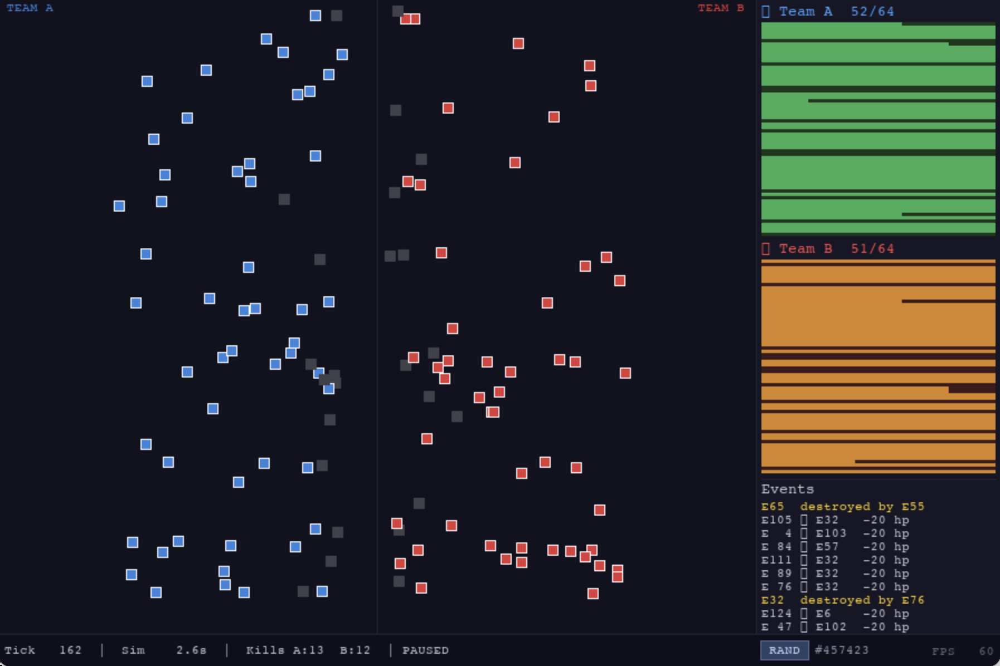

# TankBattleSim

A real-time tank battle simulator with a C++ ECS engine, pygame visualizer, and FastAPI analytics service — communicating through a shared JSONL event log.

---

## Architecture

```
┌─────────────────────────────────────────────────────────────────────┐
│                          TankBattleSim                              │
│                                                                     │
│   ┌──────────────┐    writes     ┌──────────────────────┐           │
│   │  C++ Engine  │ ──────────▶  │ shared/              │           │
│   │  (tank_sim)  │              │ battle_log.jsonl      │           │
│   │              │              │                       │           │
│   │  ECS · 64v64 │              │  tank_moved           │           │
│   │  8 threads   │              │  damage_dealt         │           │
│   │  ~3s/battle  │              │  tank_destroyed       │           │
│   └──────────────┘              └──────────┬────────────┘           │
│                                            │                        │
│                          ┌─────────────────┴──────────────┐         │
│                          │                                │         │
│                          ▼                                ▼         │
│              ┌───────────────────┐          ┌────────────────────┐  │
│              │ Pygame Visualizer │          │ FastAPI Analytics  │  │
│              │                   │          │                    │  │
│              │ Real-time replay  │          │ EventConsumer      │  │
│              │ Seed control      │          │ PostgreSQL via     │  │
│              │ HP bars · Events  │          │ SQLAlchemy async   │  │
│              └───────────────────┘          └────────────────────┘  │
└─────────────────────────────────────────────────────────────────────┘
```

---



---

## Components

### `cpp_sim/` — C++17 ECS Battle Engine

The simulation core runs two teams of 64 tanks on an 800×600 battlefield. It is built on a hand-rolled Entity-Component-System with contiguous `ComponentPool<T>` storage for cache locality. `MovementSystem` and `AISystem` execute in parallel via a custom `ThreadPool`/`JobSystem`, while `CombatSystem` runs serially to keep hit detection deterministic. Every combat event and tank position is written to `shared/battle_log.jsonl` in real time. A `--seed` flag makes any battle fully reproducible; omitting it draws from `std::random_device`. The binary also supports a `--benchmark` mode that runs 1/2/4-thread configurations and writes a comparison table.

### `visualizer/` — Pygame Real-Time Replay

A 900×600 pygame window that tails `battle_log.jsonl` and replays the battle tick by tick at ~60 sim-ticks/second. The battlefield panel renders tanks at their exact simulation coordinates with team colours and a dead-tank grey. The sidebar shows a live HP bar for each of the 128 tanks and a rolling combat event log. The bottom bar displays tick, simulated time, and kill counts. Pressing **RAND** launches `tank_sim` with a fresh random seed as a subprocess and auto-reloads the log when it finishes. SPACE pauses, R restarts replay, ESC quits.

### `analytics/` — FastAPI Analytics Service

An async FastAPI service that ingests the event log into PostgreSQL while the simulation runs. A background `EventConsumer` task tails `battle_log.jsonl` via a non-blocking `FileWatcher`, batches events into groups of 50, and upserts per-tank statistics. Battles, events, and tank performance are persisted in three normalised tables. A REST API exposes five endpoints for querying battle history, per-tank stats, and an all-time kills leaderboard.

---

## Why C++ + Python Split

Performance-critical simulation logic — collision detection, hit resolution, AI steering, and physics integration — must process thousands of entity state updates per tick without GC pauses or interpreter overhead. Python's GIL would serialise the AI and movement passes that here run in parallel C++ threads, making it the wrong tool for the hot path.

Python earns its place on the tooling side. pygame's 2D rendering, asyncio I/O, and SQLAlchemy's async ORM would take significant effort to replicate in C++, and none of them are latency-sensitive. The JSONL boundary between the two worlds is deliberately thin — any language that can open a file and parse JSON can participate. The two sides can be developed, tested, and deployed entirely independently, which is the standard pattern in game engine architecture: a native-code simulation core sharing only a wire protocol with higher-level services written in whatever language fits the task.

---

## Technical Highlights

**ECS with cache-friendly contiguous component storage**
Each component type lives in its own `ComponentPool<T>` — a flat `std::vector<T>` indexed by entity ID. Iterating over all `Transform` components is a single linear scan with no pointer chasing. `World::view<A, B>()` intersects the live-entity sets of two pools in O(n) and yields only entities that have both, keeping the hot path free of branch misprediction.

**Custom ThreadPool with `condition_variable`**
`ThreadPool` manages a fixed worker thread count, a `std::queue<std::function<void()>>` protected by a `std::mutex`, and a `std::condition_variable` that parks idle threads at zero CPU cost. `JobSystem::submit()` wraps a callable in a `std::packaged_task` and returns a `std::future<T>`, letting the main thread block only on the results it actually needs.

**Deterministic replay with seed control**
Passing `--seed <N>` to `tank_sim` initialises the `std::mt19937` RNG with that value, producing an identical battlefield layout and sequence of AI decisions every run. The visualizer's RAND button picks a random seed, passes it to the subprocess, then reloads the log — so every battle is both random and reproducible on demand.

**Async Python services with asyncio + SQLAlchemy**
The analytics service uses `create_async_engine` with the `asyncpg` driver. `EventConsumer` runs as a long-lived `asyncio.Task` started in FastAPI's `lifespan` hook; `FileWatcher.tail()` is an `async for` generator that yields parsed JSON without blocking the event loop. DB writes are batched and committed every 50 events to amortise round-trip latency.

---

## Performance

Benchmark: 64 tanks/team, fixed seed 42, Release build, Apple M-series (8 hardware threads).

```
+----------+----------+---------+
| Threads  |     Time | Speedup |
+----------+----------+---------+
|        1 |   2.736s |  1.00x |
|        2 |   2.754s |  0.99x |
|        4 |   2.716s |  1.01x |
+----------+----------+---------+

Winner: Team B in 936 ticks
```

At 64v64 the per-tick work is under 1 ms — below the threshold where thread dispatch overhead pays off; parallelism becomes measurable above ~1 000 entities per team.

---

## Build & Run

### Prerequisites

| Tool | Version |
|---|---|
| CMake | ≥ 3.20 |
| C++ compiler | clang++ or g++ with C++17 |
| Python | 3.9+ |
| Docker + Compose | any recent version |

### 1. Infrastructure (PostgreSQL)

```bash
docker compose up -d postgres
```

PostgreSQL 15 → `localhost:5432`  
`db: tanksim` · `user: tanksim` · `password: tanksim_secret`

### 2. C++ Engine

```bash
cd cpp_sim
cmake -B build -DCMAKE_BUILD_TYPE=Release
cmake --build build --parallel
```

**Run a battle:**
```bash
./build/tank_sim                  # random seed
./build/tank_sim --seed 42        # fixed seed
./build/tank_sim --benchmark      # 1/2/4-thread comparison
```

**Tests (87 passing):**
```bash
cd build && ctest --output-on-failure
```

Output is written to `shared/battle_log.jsonl`.

### 3. Visualizer

```bash
cd visualizer
pip install -r requirements.txt
python main.py
```

Controls: `RAND` — new random battle · `SPACE` — pause · `R` — restart replay · `ESC` — quit

### 4. Analytics Service

```bash
cd analytics
pip install -r requirements.txt
uvicorn analytics.main:app --reload --port 8000
```

**Endpoints:**

| Method | Path | Description |
|---|---|---|
| GET | `/api/v1/health` | Service liveness |
| GET | `/api/v1/battles` | Last 50 battles |
| GET | `/api/v1/battles/{id}` | Single battle detail |
| GET | `/api/v1/tanks/{id}/stats` | Per-tank history |
| GET | `/api/v1/leaderboard` | Top tanks by kills |

---

## Project Structure

```
TankBattleSim/
│
├── shared/
│   ├── battle_log.jsonl          # Live event stream (JSONL) written by C++ sim
│   └── benchmark_results.txt     # Last benchmark run output
│
├── cpp_sim/
│   ├── CMakeLists.txt            # CMake build — sim binary + test binary
│   ├── src/
│   │   ├── main.cpp              # Entry point: game loop, benchmark mode, arg parsing
│   │   ├── ecs/
│   │   │   ├── Entity.h          # EntityManager — ID allocation and live-set tracking
│   │   │   ├── ComponentPool.h   # Contiguous flat storage for one component type
│   │   │   └── World.h           # ECS façade: createEntity, addComponent, view<A,B>
│   │   ├── components/
│   │   │   ├── Transform.h       # Position (x, y, angle) + spawn position
│   │   │   ├── Movement.h        # Velocity + max speed + acceleration
│   │   │   ├── Health.h          # HP, max HP, armour
│   │   │   ├── Weapon.h          # Damage, range, fire rate, cooldown
│   │   │   ├── Team.h            # Team enum (TEAM_A / TEAM_B)
│   │   │   ├── Target.h          # Currently locked enemy entity
│   │   │   └── ShootIntent.h     # Flag set by AISystem, consumed by CombatSystem
│   │   ├── systems/
│   │   │   ├── ISystem.h         # Base interface: update(World&, float dt)
│   │   │   ├── MovementSystem.h  # Integrates velocity into position
│   │   │   ├── AISystem.h        # Target acquisition, steering, shoot-intent logic
│   │   │   └── CombatSystem.h   # Resolves ShootIntents, applies damage, logs events
│   │   ├── threading/
│   │   │   ├── ThreadPool.h      # Fixed-size worker pool with condition_variable
│   │   │   └── JobSystem.h       # submit() → future<T>, parallelFor() helper
│   │   └── utils/
│   │       ├── EventLogger.h     # Thread-safe JSONL writer to battle_log.jsonl
│   │       ├── Timer.h           # High-resolution wall-clock timer
│   │       └── constants.h       # Shared numeric constants
│   └── tests/
│       ├── test_ecs.cpp          # ECS core: entity creation, component add/get/view
│       ├── test_components.cpp   # Component struct invariants and defaults
│       ├── test_systems.cpp      # System logic: movement integration, combat damage
│       └── test_threading.cpp    # ThreadPool correctness, future resolution, parallelFor
│
├── visualizer/
│   ├── main.py                   # Pygame loop, RAND button, subprocess launcher
│   ├── config.py                 # Window dimensions, colours, paths, FPS
│   ├── data/
│   │   └── event_reader.py       # Buffered JSONL replay with tick-by-tick drain
│   └── renderer/
│       ├── battlefield.py        # Tank sprites mapped from sim coords to screen pixels
│       └── hud.py                # Sidebar HP bars, event log, bottom status bar
│
├── analytics/
│   ├── main.py                   # FastAPI app with lifespan (starts/stops EventConsumer)
│   ├── requirements.txt          # fastapi, uvicorn, sqlalchemy, asyncpg, alembic …
│   ├── db/
│   │   ├── database.py           # Async engine, AsyncSessionLocal, get_db, init_db
│   │   └── crud.py               # Async CRUD: battles, events, tank stats, leaderboard
│   ├── models/
│   │   ├── battle.py             # Battle and BattleEvent ORM models
│   │   └── tank.py               # TankStats ORM model (unique per tank+battle)
│   ├── api/
│   │   └── routes.py             # Five REST endpoints under /api/v1
│   └── worker/
│       ├── file_watcher.py       # Async readline tail of battle_log.jsonl
│       └── event_consumer.py     # Batched DB writer, skips tank_moved, finishes battle
│
└── docker-compose.yml            # PostgreSQL 15 + RabbitMQ 3 services
```
